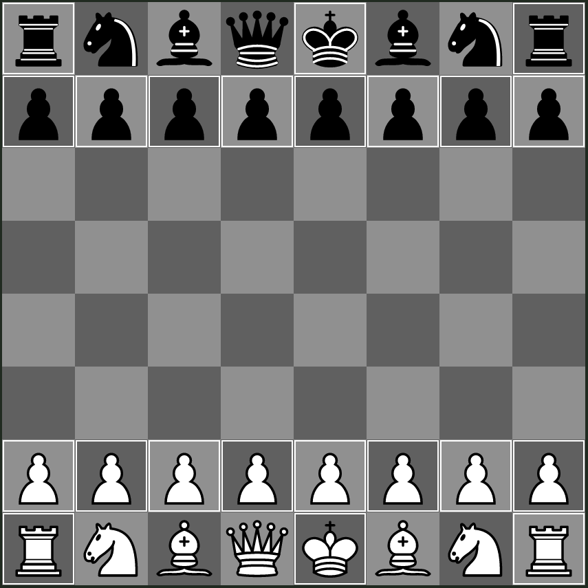

## Standard

The standard variant, equivalent to the standard starting position in 2D Chess.

This variant is vulnerable to the f7 sacrifice, [an analysis of the f7 sacrifice can be found here](https://docs.google.com/document/d/1AciKETPQWlpw3tBrmAQ_skABzcfD9D2g_7aGfAuKH9Y/edit).

