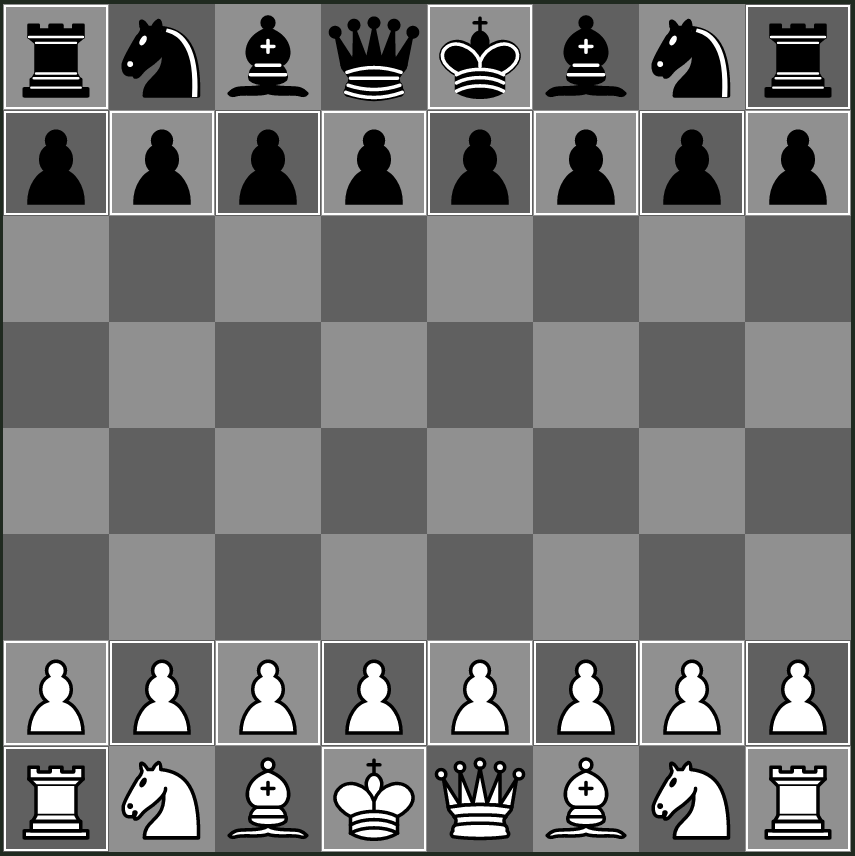

## Standard - Half Reflected

This variant is similar to `Standard`, where black's king and queen are swapped.
This cuts off the easy diagonals and triagonals to black's weak pawn (now c7), and makes it hard for white to checkmate should they still pull such a sacrifice off.

