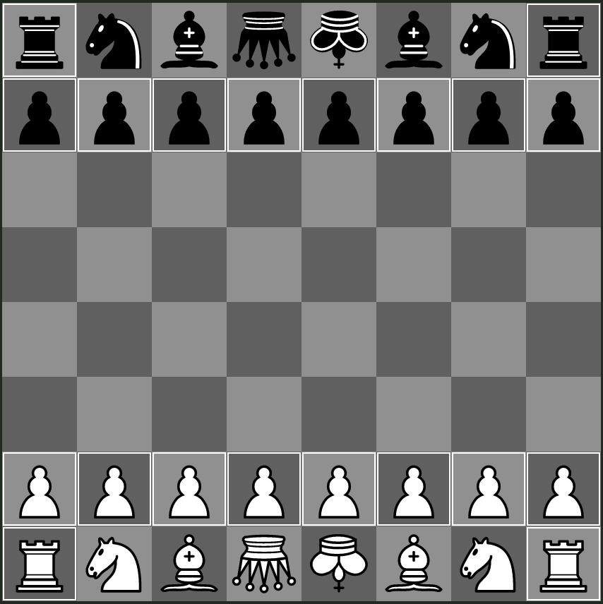

## Standard - Reversed Royalty

The starting position of this variant is similar to that of `Standard`, with the only difference that the role of the queen and the king are reversed:

- The queen becomes the royal queen; capturing one of the opponent's royal queen results in an immediate victory, check rules follow from this definition
- The king becomes the common king; capturing one of the opponent's common king *does not* result in an immediate victory, and the common king is not subject to checks

Because of the added weakness to the royal queen, queen sacrifices are impossible. The common king is also a useful asset, which has movement different from the other pieces.

The upside-down queens and kings correspond to respectively the royal queen and common king.
