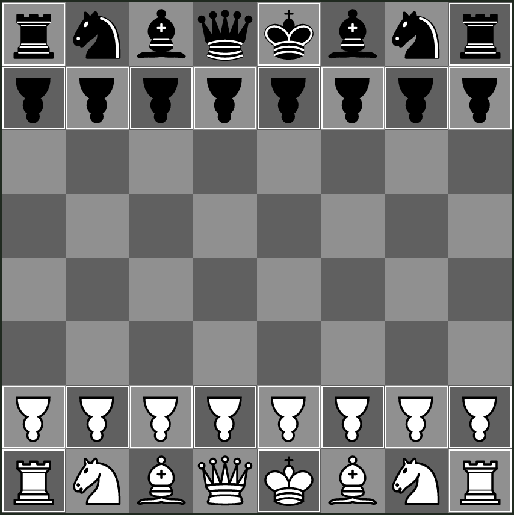

## Standard - Brawns

This variant is very similar to `Standard`, with the only difference that pawns are replaced with brawns (pawns with more 5D Chess-specific moves).

This variant is vulnerable to the `f7` sacrifice, as brawns cannot take pieces next to them in the past.

The upside-down pawns correspond to the brawns.
