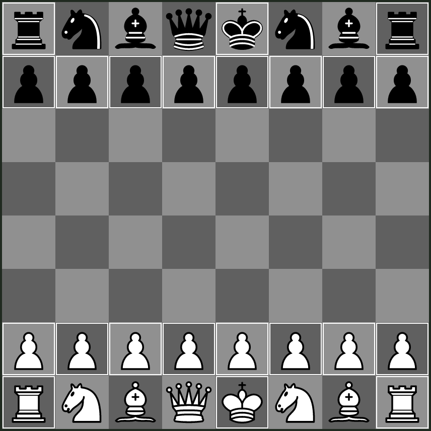

## Standard - Defended Pawn

An alternative version of `Standard - Defended Pawn`, where the right knight and bishops are swapped instead.
This makes queen development similar to 2D chess and allows for either of the knights to be developped without compromising the king's defences.

The drawback of this variant is that the h-rooks and g-pawns are very vulnerable.

