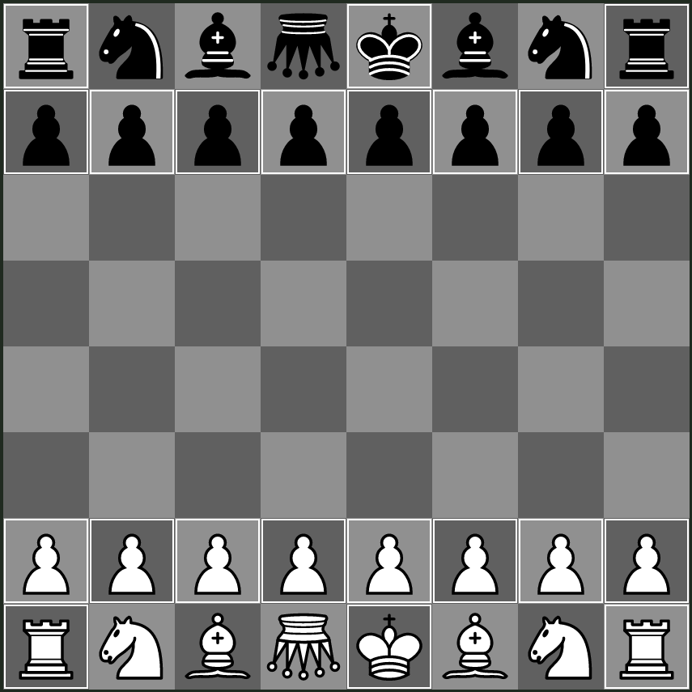

## Standard - Double Royalty

A variant of `Standard - Reversed Royalty`, where the king is not replaced with a common king. Each player thus starts with two royal pieces (royal queen and normal king).

The inverted queen corresponds to the royal queen.
