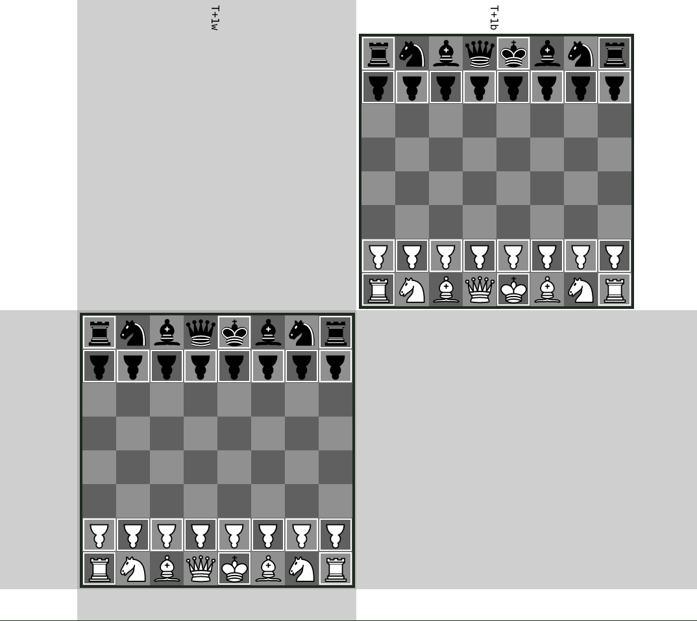

## Standard - Staggered Timelines - Brawns

This variant is a mix of `Standard - Brawns` and `Standard - Staggered Timelines`.
It replaces all of the pawns in `Standard - Staggered Timelines` with brawns.

Brawns have greater cross-timeline capture abilities.

The top timeline is the `-0` timeline, while the bottom timeline is the `+0` timeline.
The upside-down pawns correspond to the brawns.
