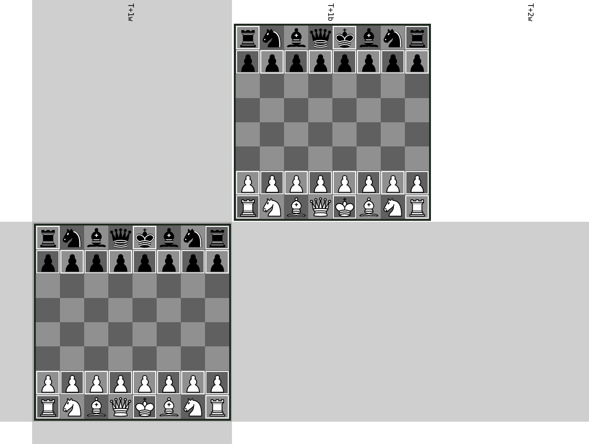

## Standard - Staggered Timelines

This variant is similar to `Standard - Two Timelines`, with the only difference that the `-0` timeline starts out on black's turn.

The top timeline is the `-0` timeline and the bottom timeline is the `+0` timeline.
