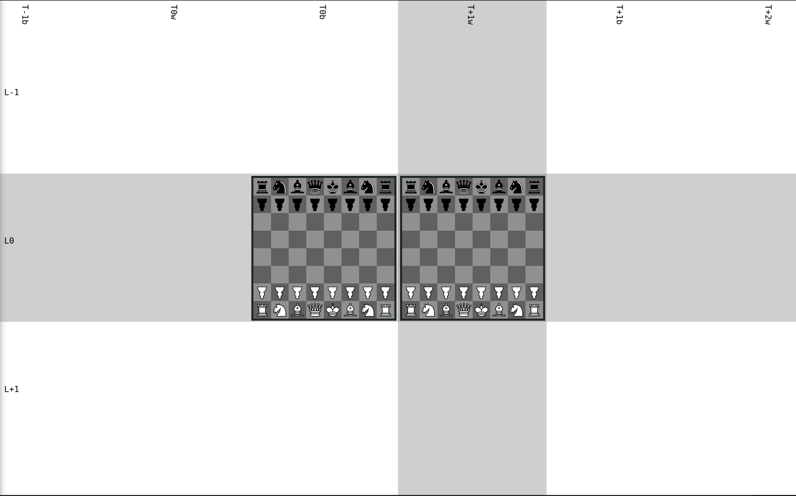

## Standard - Turn Zero - Brawns

This variant is a mix of `Standard - Turn Zero` and `Standard - Brawns`; the pawns of `Standard - Turn Zero` have been here replaced with brawns.
Like `Standard - Turn Zero` over `Standard`, `Standard - Turn Zero - Brawns` mitigates the threat of the `f7` sacrifice over `Standard - Brawns` by allowing black to time travel first, forcing white to defend against that threat too.

The upside-down pawns correspond to the brawns.
