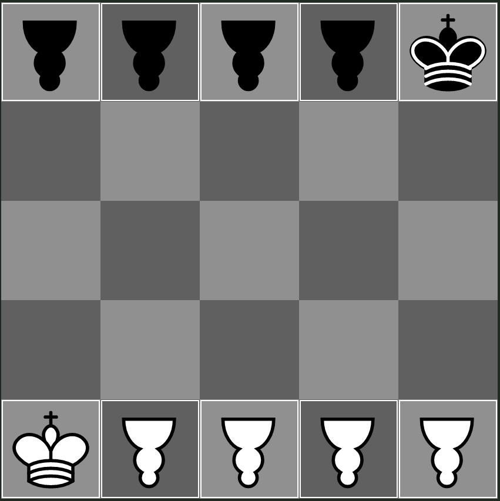

## Brawns - Small

A variant showcasing brawns, originally named "Focused - Just Brawns".
Brawns are aligned on either end of a 5x5 board and can immediately jump two squares forward.
Kings are on opposite corners of the board, and are thus vulnerable to the opponent's brawns.

This variant very quickly leads to endgames and complex positions. It has not been solved yet.

The upside-down pawns correspond to the brawns.
