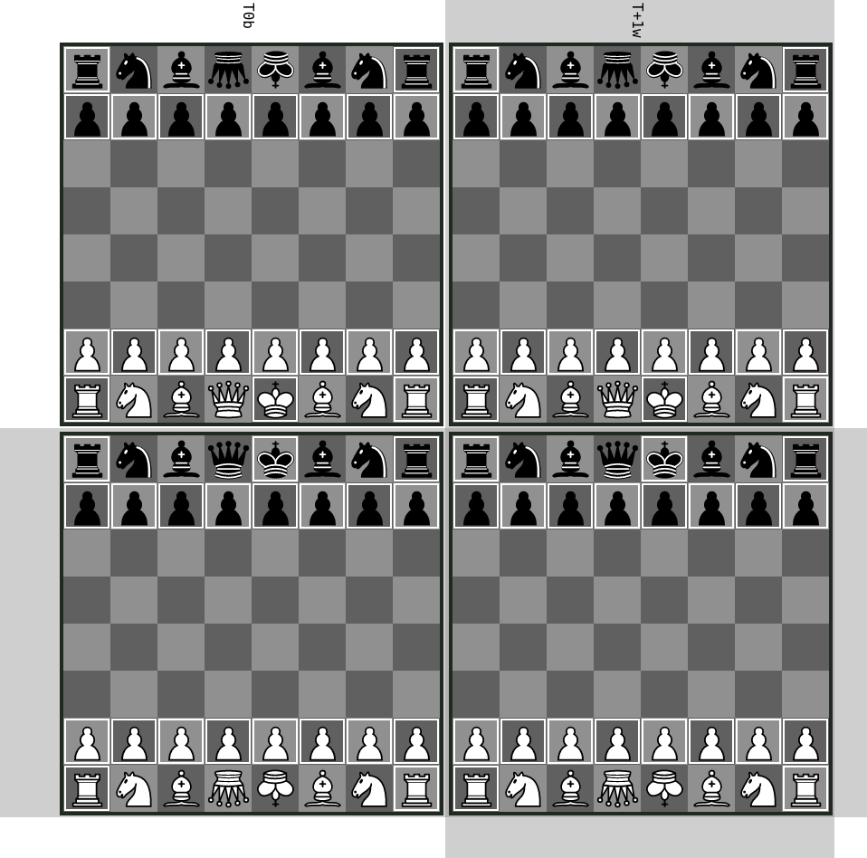

## Royalty war

This variant is a mix between `Standard - Reversed Royalty`, `Standard - Turn Zero` and `Standard - Two Timelines`.
It starts with two timelines, `-0` and `+0`, each having two copies of the same board on `T1w` and `T0b`:

- on `-0`, black has a royal queen and a common king, while white has a normal queen and a normal king
- on `+0`, black has a normal queen and a normal king, while white has a royal queen and a common king

The inverted queens and kings correspond respectively to the royal queens and the common kings.
The top timeline is the `-0` timeline, while the bottom timeline is the `+0` timeline.
