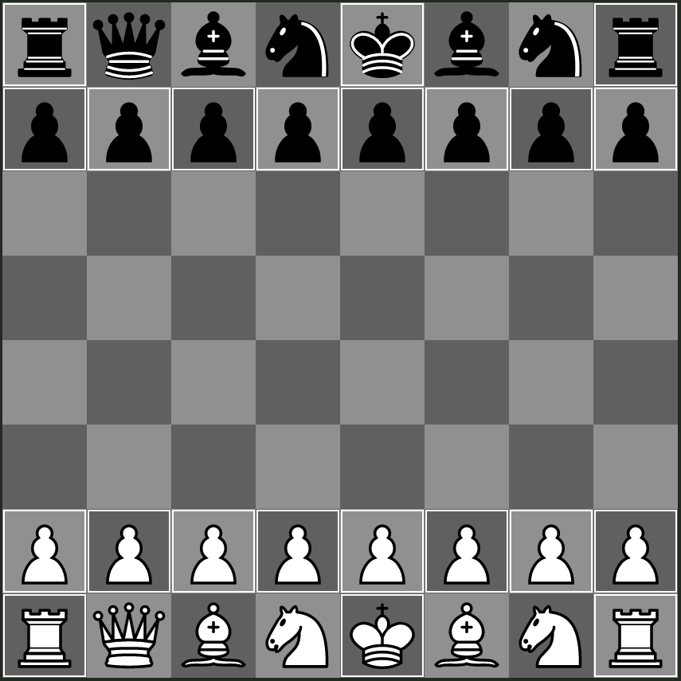

## Standard - Defended Pawn

This variant is similar to `Standard`, where the left knight and queen are swapped.
This makes it so that all of the pawns around the king are defended by non-royal pieces, forbidding the f7 sacrifice.

An alternate, defended pawn variant can be found at `Standard - Defended Pawn - Alt`.

