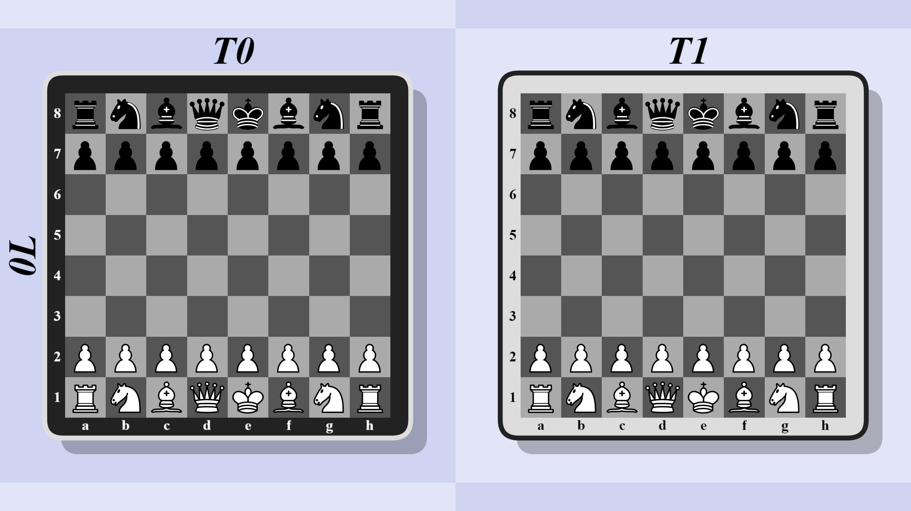

## Standard - Turn Zero

This variant is the same as `Standard`, with the only difference that the starting board has been cloned and put on turn zero, on black's turn.
This allows black to execute the `f2` sacrifice before white if white doesn't defend against it, and it also allows black to time travel to an unmoved board.

This variant has been seen to be more balanced than `Standard`, and there are a few openings available to either player, which are covered in [pseudoAbstractMeta and Los Bros' document](https://docs.google.com/document/d/10c7CvySjnI74WXSp6SkQeirZXTEbEK889ENcQky2_Hw/edit).

